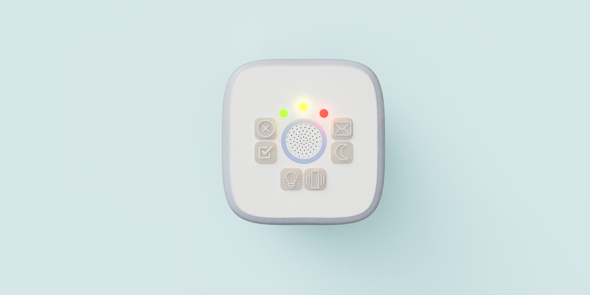
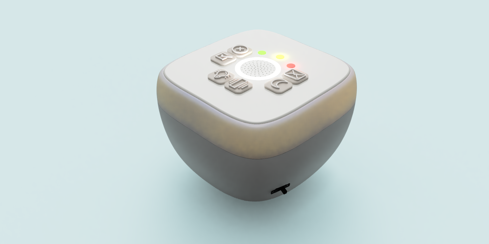
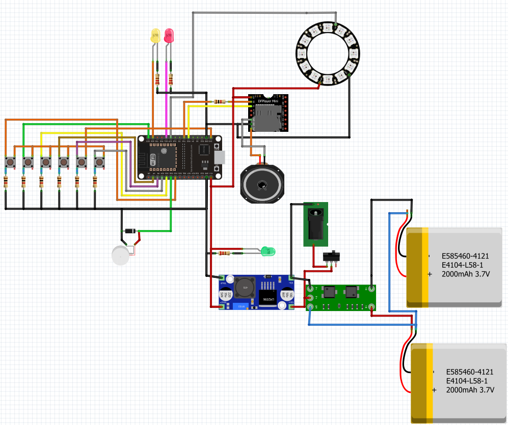

## Dispositivo para parejas

[Para ingresar al repositorio de GitHub de Cómplices, haga click aquí](https://github.com/accesibilidad-inclusion/complices)

Este proyecto propone la creación de un **artefacto sensorial-afectivo**, que busca aludir al tacto y al sentir que existe entre dos personas.

Las parejas pueden construir un **lenguaje propio con códigos únicos entre ambos**, mediante elementos como luces, sonidos o vibraciones. 

Este artefacto busca crear un momento de comunicación íntima entre parejas. El dispositivo dialoga con la persona a través de una interfaz simple e intuitiva., y busca desvincularlo del teléfono, el espacio más común donde recurrimos para comunicarnos. 

Se propone un objeto pequeño y portable que apunta a potenciar  la intimidad y complicidad de una pareja con este dispositivo. Este artefacto busca crear un momento de comunicación íntima entre parejas. 





### Contexto 

[Para mayor información acerca de la investigación realizada en el  proyecto de Apoyos a la vida independiente de adultos con discapacidad intelectual haga click aquí](https://wiki.ead.pucv.cl/Apoyos_a_la_vida_independiente_de_adultos_con_discapacidad_intelectual:_Artefacto_compartido)

La vida independiente se comprende como una cuestión de derechos, donde las personas merecen tener la posibilidad de control sobre su vida. En Chile y sudamérica, es un tema que se encuentra aún en  desarrollo, existiendo actualmente muchas barreras personales, sociales y de infraestructura que afectan el ejercicio de una plena vida independiente. Esta problemática afecta de mayor manera a las poblaciones vulnerables, como son las personas con Discapacidad Intelectual (DI). Sin embargo, existen apoyos que pueden promover el desarrollo personal de un individuo, permitiéndoles un mejor funcionamiento y así incrementando su independencia y autodeterminación en la sociedad. 
 
El concepto nace desde las propias necesidades sentidas, declaradas por un grupo asesor de adultos con DI en Valparaíso, Chile, mediante un proceso de investigación inclusiva y codiseño, donde identificaron las relaciones de pareja, como un vínculo muy relevante dentro de sus vida y como un eslabón clave para su vida independiente. A pesar de que la mayoría de los adultos con DI en Chile no tienen la posibilidad de vivir con sus parejas de forma independiente, suelen mantener su relación a distancia. Esta situación se ha visto agravada por la pandemia la cual ha forzado un mayor distanciamiento durante la cuarentena.
 
Los vínculos socio-afectivos en personas con D.I significan una mayor dificultad por el poco desarrollo de sus habilidades sociales; sin embargo, tienen un gran impacto tanto en su bienestar personal como en procesos de inclusión a la sociedad. La conceptualización histórica sobre la discapacidad ha segregado la dimensión afectivo-sexual, hacia un enfoque netamente sexual, dejando de lado la afectividad.

## Sistema tecnológico

El sistema electrónico del aparato consiste en el envío de **señales categorizadas**, luces o vibraciones, a su **dispositivo gemelo**, conectado a distancia por red Wi Fi; el dispositivo acompaña las acciones realizadas del aparato mediante una voz de apoyo.  



*En la imagen se muestran las conexiones electrónicas de los componentes del aparato para su funcionamiento*
















